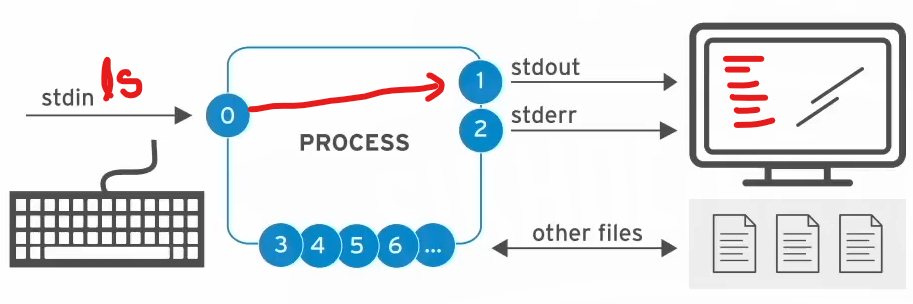
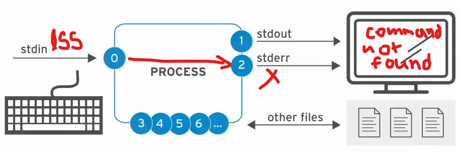
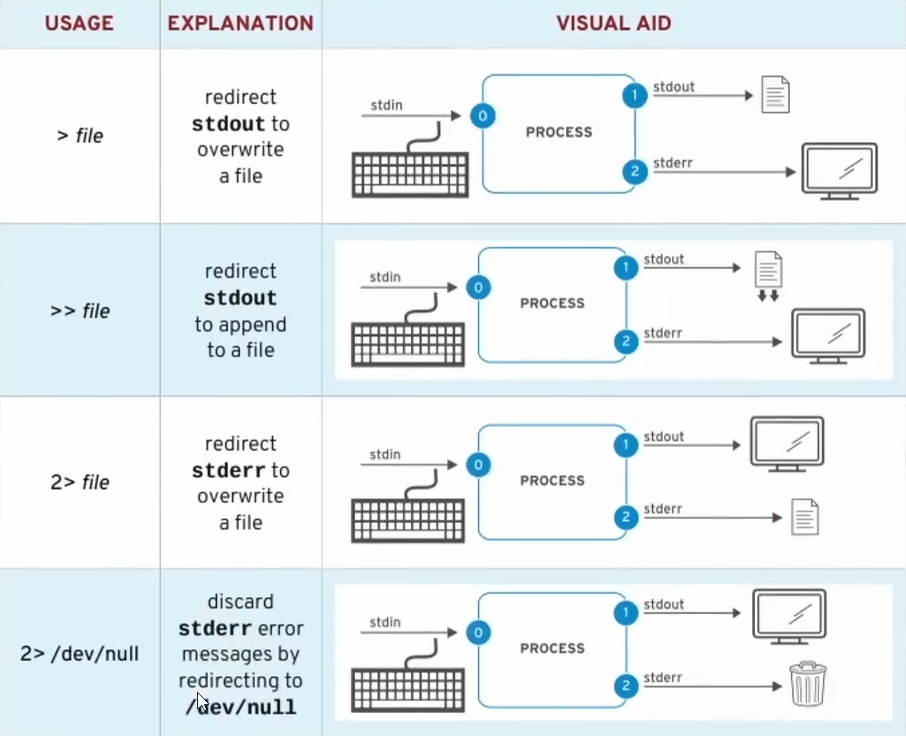
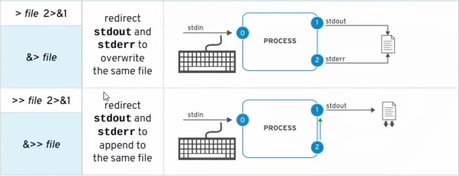

## `Standand Input` -----> `Process` -----> `Standand Output` || `Standand Error`:  

##### Preview:  
  

Here’s a table summarizing standard input, output, and error channels in Linux:

| **Number** | **Channel Name**  | **Description**                         | **Default Connection** | **Usage** |
|-----------|-----------------|-------------------------------------|----------------------|------------|
|  **0**  |  `stdin`  |  Standard Input  |  Keyboard  |  read only  |
|  **1**  |  `stdout`  |  Standard Output  |  Terminal  |  write only  |
| **2**     |  `stderr`  | Standard Error |  Terminal  |  write only  |
| **3**     |  `filename`  |  Other File  |  none  |  read &/or write  |

#### accurate operation:  
  
#### in-accurate operation:  
  

### Redirecting outputs  
  
  