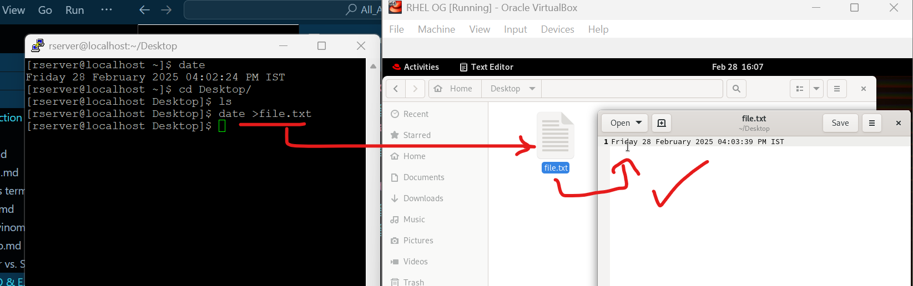

### 1. Redirection `>`    
`information / output` -----> `file.txt`
```bash
date >file.txt
```  
#### we can see the actions rection at GUI immediatly  
  
& we can verify it by opening it with text viewer  
  
but we will use terminal approach & use GUI minimally  
```bash
cat file.txt
```  
#### Output:  
```vbnet
Friday 28 February 2025 04:03:39 PM IST
```  
if we use  
```bash
date >file.txt
```  
it will overwrite same contect  
```bash
cat file.txt
```  
#### Output:  
```vbnet
Friday 28 February 2025 04:12:16 PM IST
```  
if we want to containt both information we need to concate instead of overwritting it  