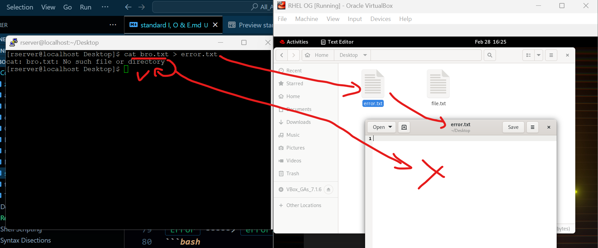
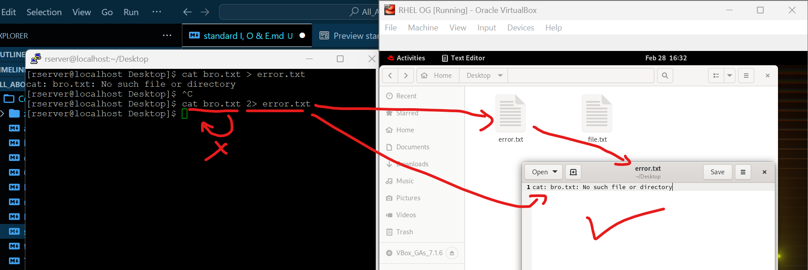

### 3. Error Redirection `2>`  
we use `>` to redirect information, but we cannot redirect error with only `>`.  
lets try that anyway  
- try to redirect `error` in `error.txt`  
`Error` -----> `error.txt`  
```bash
cat bro.txt > error.txt
# 'cat bro.txt' : trying to read file which does not exists
# '> error.txt' : save the error into error.txt file
```  
#### Output:  
```vbnet
cat: bro.txt: No such file or directory
```  
##### Preview:  
  
it did not worked because  
although it created `error.txt` file with redirection syntax (`>`) but the error is not stored or logged into file as we can see in image, instead it omitted that into terminal  `but this default redirection is good if we only want to save operations & neglect errors`  
now lets try same command but just replace `>` with `2>`  
```bash
cat bro.txt 2> error.txt
# 'cat bro.txt' : trying to read file which does not exists
# '2> error.txt' : save the error into error.txt file
```  
##### Preview:  
  