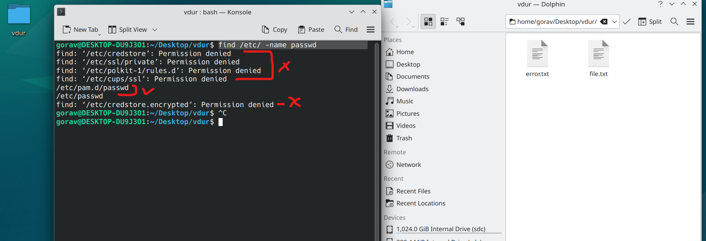
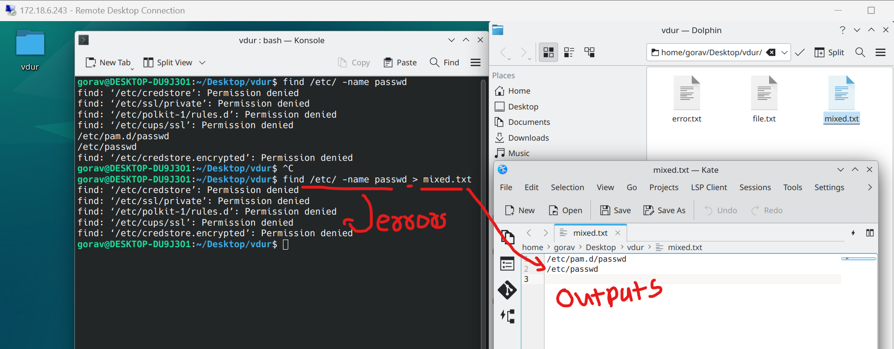

### 4. Error Discarding `2> /dev/null`  
`Error` -----> `/dev/null`  
`output` -----> `output.txt`  
```bash
find /etc/ -name passwd
```  
#### Output:  
```vbnet
find: ‘/etc/credstore’: Permission denied
find: ‘/etc/ssl/private’: Permission denied
find: ‘/etc/polkit-1/rules.d’: Permission denied
find: ‘/etc/cups/ssl’: Permission denied
/etc/pam.d/passwd
/etc/passwd
find: ‘/etc/credstore.encrypted’: Permission denied
```  
##### Preview:  
  
here we deleberately choose this command where it gives some success & some failures in executions  

if we have this case, where the result contains output & error both, it becomes tricky situation to store the logs, let see why  

#### A. lets try to do normal Redirection (`>`)  
```bash
find /etc/ -name passwd > mixed.txt
```  
##### as expected, it leaves the errors for terminal & stores outputs in file:  
  

#### B. lets try to do Error Redirection (`2>`)  
```bash
find /etc/ -name passwd > mixed.txt
```  
##### as expected, vice-versa it leaves the outputs for terminal & stores errors in file:  
  

in both of this situation we either save the output or error & swith other thing into terminal  

but we can save the error is different file & output at dedicated file.  
which means terminal remains clean & we get both job done, but this method there is a catch. we save the error temporarly. which means it get distroyed as soon as we save it.  

```bash
find /etc/ -name passwd 2>/dev/null >ouput.txt
```  
##### this will same error in temporary storate & output in file:  
  
### `use case` : when we know there will be definate error but only want to store outputs & terminal should remain clean  