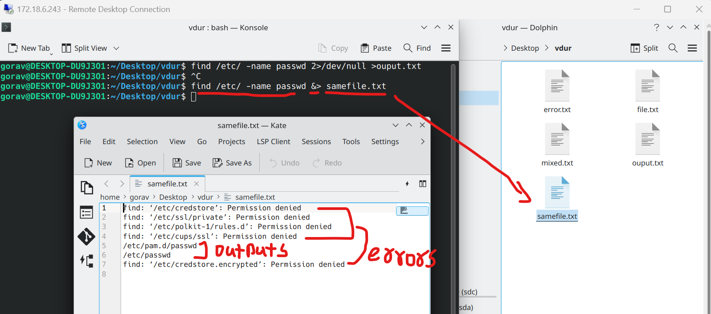
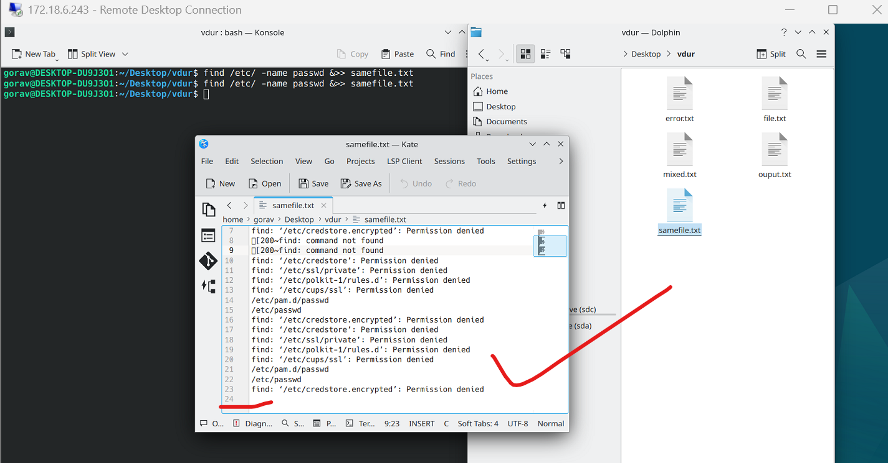

### 4. Error + Output Redirection `&>`  
`Error` + `output` -----> `samefile.txt`  
```bash
find /etc/ -name passwd &> samefile.txt
```  
##### Preview:  
  


& if we just use `&>>` instead of `&>` it will both save & append errors & output.  
```bash
find /etc/ -name passwd &>> samefile.txt
```  
##### Preview:  
  