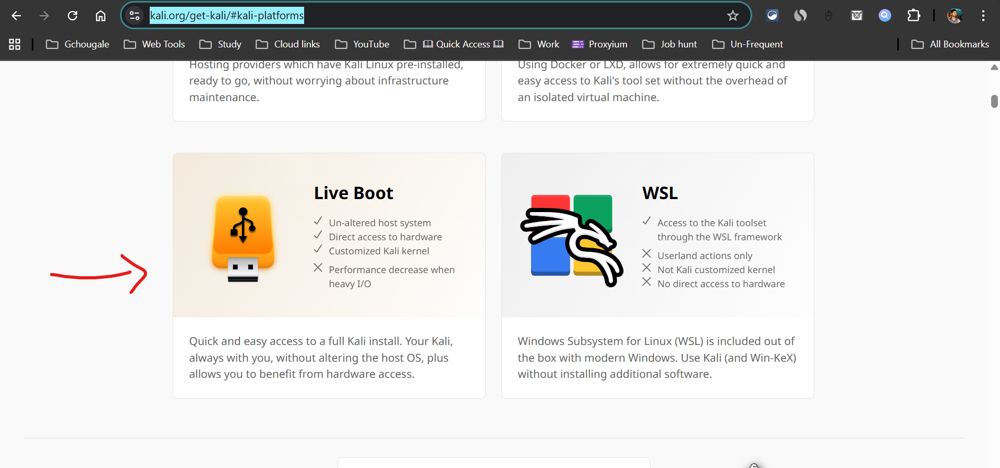

## Gathering necessary things
1. USB pendrive (64gb+ & usb 3.2 prefered)  
2. linux iso file  
`https://www.kali.org/get-kali/#kali-platforms`  
download persistant usb iso file  
##### Preview:  
  
3. Balena Etcher is prefered for persistant USB boots  
`https://etcher.balena.io/`  